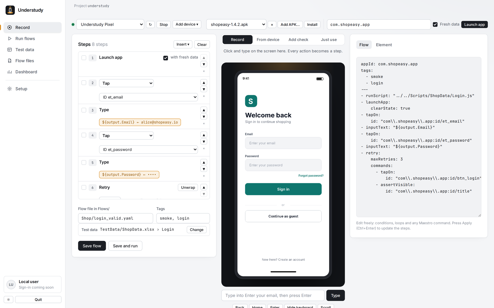
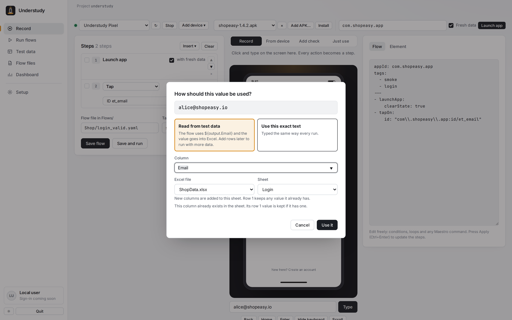
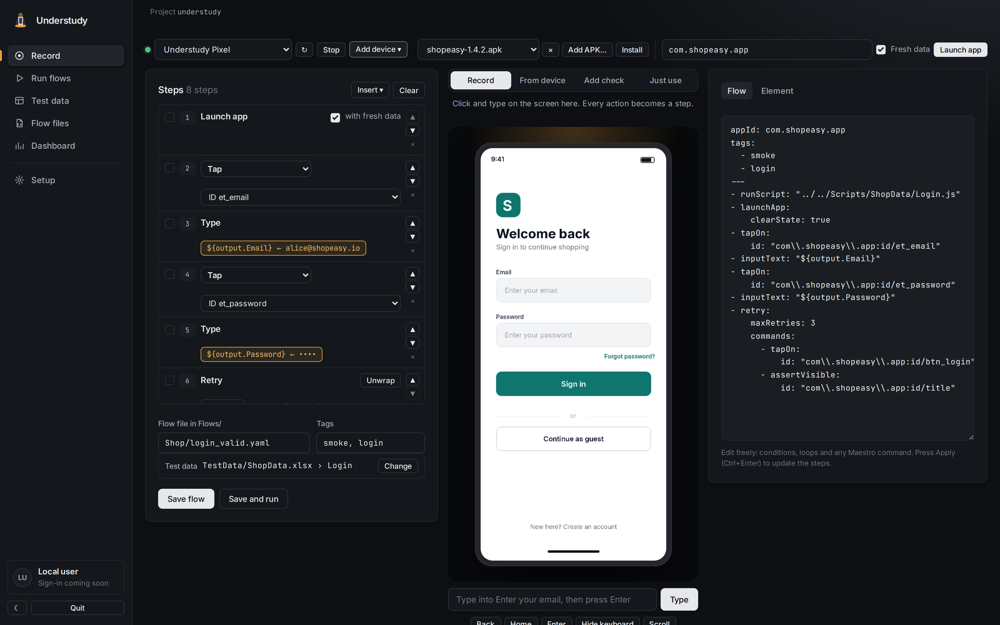
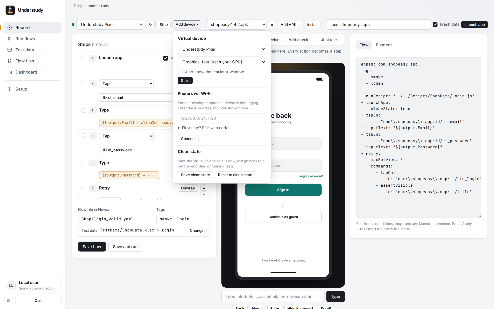
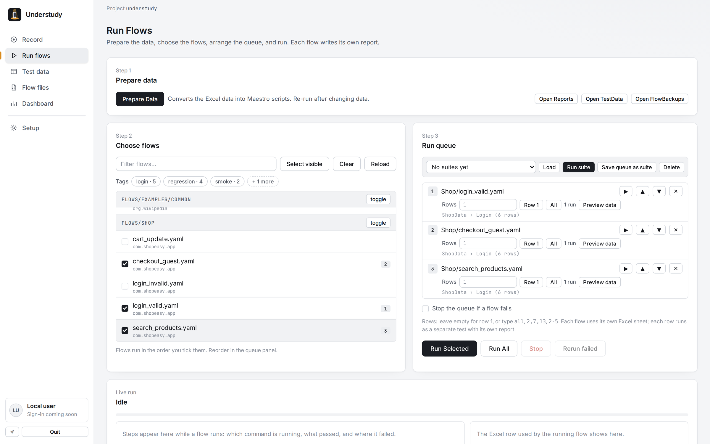
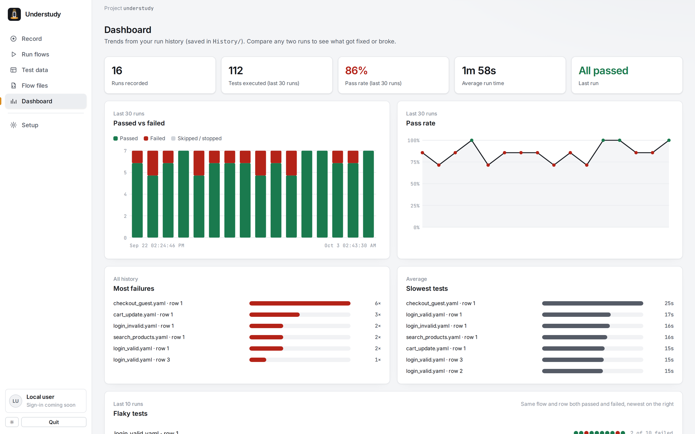
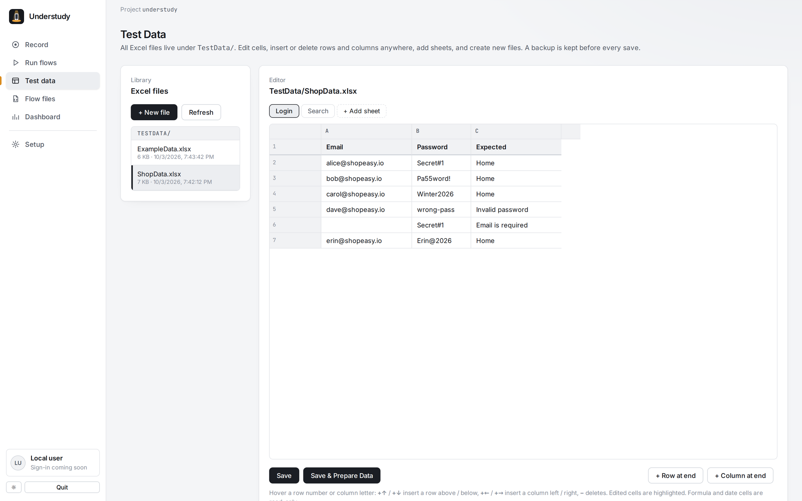
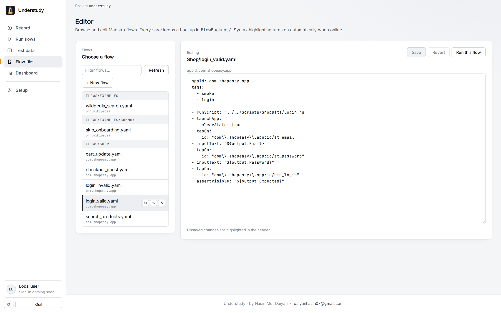
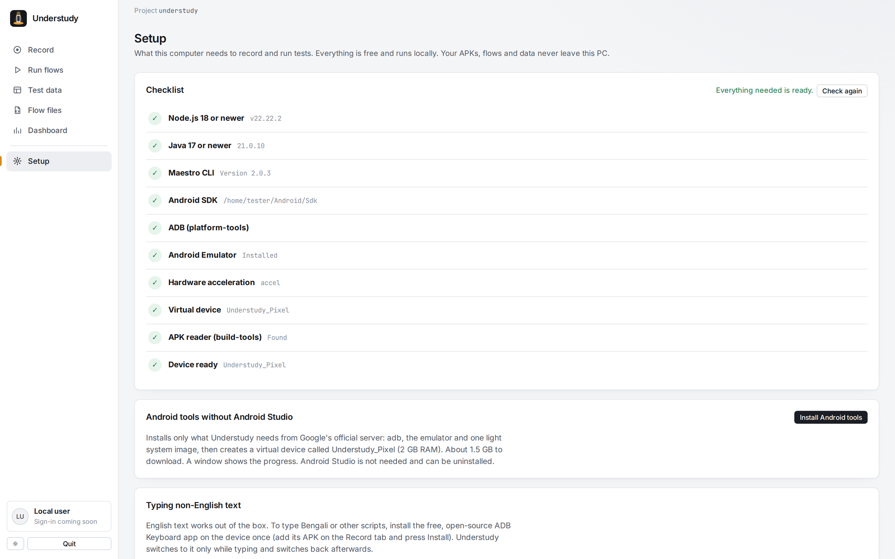
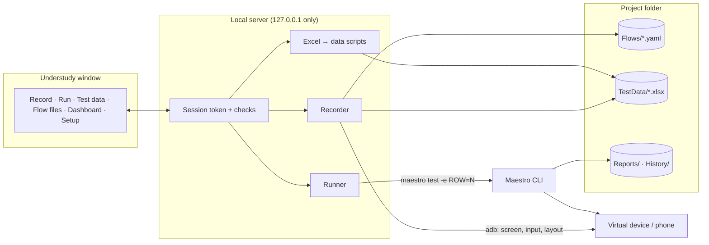

<div align="center">


# Understudy

### Record mobile tests on a virtual device. Make them data-driven with Excel. Run them with Maestro.

*Show it once. It performs a thousand times.*

[](CHANGELOG.md)
[](#requirements)
[](https://nodejs.org)
[](https://maestro.mobile.dev)
[](#security-and-privacy)
[](LICENSE)

**[Website & docs](https://YOUR-SITE.vercel.app)** · **[Quick start](#quick-start)** · **[Recording](#recording-a-flow)** · **[Changelog](CHANGELOG.md)**

<br>



</div>

---

## What is Understudy?

Understudy is a desktop-style app for **Android UI test automation** built on the [Maestro](https://maestro.mobile.dev) CLI. It replaces the usual loop of *plug in a phone → record in Maestro Studio → copy YAML → hand-edit values into `${output.x}` → maintain spreadsheets → run commands → dig through reports* with one local app:

1. **Record** a flow by clicking on a virtual device (or tapping a real phone).
2. **Decide per value** whether it's fixed text or test data. Understudy writes `${output.Email}` into the flow and the value into Excel for you.
3. **Run** any flows, in any order, with any Excel rows, and watch every step live.
4. **Compare** runs, find flaky tests, and open one HTML report per test.

Everything runs on your own PC. **No account, no cloud, no upload.** Your APKs, flows and data never leave the machine.

---

## Highlights

<table>
<tr>
<td width="50%" valign="top">

### 🎬 Record without Maestro Studio
Start a virtual device, plug in a phone, or connect one over Wi-Fi. Click on the screen inside Understudy, or switch to **From device** and use the phone itself: only touches in your app are kept, the keyboard and other apps are ignored.

</td>
<td width="50%" valign="top">

### 📊 Data-driven in one click
Type a value, choose **Read from test data**, pick the Excel file, sheet and column. The flow gets `${output.Email}`, the value becomes row 1. Add rows later, run them all.

</td>
</tr>
<tr>
<td valign="top">

### 🧩 Edit everything
Change any step's type (tap, long press, check visible…), pick a better target, move steps, wrap them in **Repeat / If visible / Retry**, or edit the YAML directly. The steps follow.

</td>
<td valign="top">

### ▶ Run and understand
Pick flows and rows, save suites, see each step as it runs, open per-test reports, and track pass rate, slowest and flaky tests on the dashboard.

</td>
</tr>
</table>

<p align="center">


</p>

---

## Features

### Recording
- **Virtual devices, USB phones and Wi-Fi phones** (Android 11+ wireless debugging, with pairing).
- **APK manager**: add an APK, install it, remove it with the × button. APKs stay in the local `Apps/` folder.
- **Four modes**: *Record* (click in Understudy), *From device* (tap on the phone or emulator window), *Add check* (click to assert visible), *Just use* (nothing recorded).
- **Smart targets**: resource ID, text, accessibility label and **placeholders** like "Enter email", including Jetpack Compose fields. Non-unique targets are flagged.
- **Step types**: tap, double tap, long press, check visible, check not visible, scroll until visible, type, clear text, swipe, scroll, back, enter, hide keyboard, wait, screenshot.
- **Conditions and loops**: Repeat N times, Repeat while visible, If visible, Retry. Nest them.
- **Two-way flow editor**: edit the YAML, press Apply, and the steps update. Any other Maestro command is kept as a custom step.
- **Clean state**: snapshot a virtual device and go back to it before recording or testing.
- **Non-English typing** (e.g. Bengali) through the free ADB Keyboard app.

### Test data
- Plain `.xlsx` files: **row 1 = column names, one row per test case**.
- From the recorder: use an **existing file and sheet**, an **existing file with a new sheet**, or a **new file**. Existing columns are suggested.
- Built-in **Excel editor**: edit cells, insert/delete rows and columns, add sheets, new workbooks, automatic backups.

### Running
- Run **selected flows in your order**, one flow, everything, or a **saved suite**.
- **Rows per flow**: `1`, `all`, `2,7,13`, `2-5`, `1,4-6,10`. Each row is its own test and report.
- **Stop**, **stop on first failure**, **rerun failed**.
- **Live steps** with timings, the Excel row in use, failure screenshots, full console.

### Insight
- **Dashboard**: runs, pass rate trend, passed vs failed, most failures, slowest tests, **flaky tests**.
- **Compare two runs**: fixed, newly failing, still failing, time change, failed step.

### Comfort
- Starts like a desktop app (no console window), sidebar layout, light and dark themes.
- **Setup checklist** tells you exactly what's missing, and **Install Android tools** sets up adb, the emulator and a light virtual device **without Android Studio**.

---

## Screenshots

| | |
|---|---|
| **Record** with steps, device and flow<br> | **Fixed text or test data**<br> |
| **Devices**: virtual, Wi-Fi, clean state<br> | **Run flows** with rows per flow<br> |
| **Dashboard**<br> | **Excel editor**<br> |
| **Flow files**<br> | **Setup checklist**<br> |

*Screenshots use a demo app.*

---

## Requirements

| You need | Why | Get it |
|---|---|---|
| **Windows 10/11**, virtualization on | Runs the virtual device | Virtualization in BIOS + *Windows Hypervisor Platform* in Windows Features |
| **Node.js 18+** | Runs Understudy | [nodejs.org](https://nodejs.org) |
| **Java 17+** | Maestro and the Android tools | [adoptium.net](https://adoptium.net) |
| **Maestro CLI** on `PATH` | Runs the tests (Maestro Studio **not** needed) | [Install Maestro](https://docs.maestro.dev/getting-started/installing-maestro) |
| **Android tools** | adb, emulator, a virtual device | Understudy → Setup → **Install Android tools** |

8 GB RAM works with the light virtual device; 16 GB is comfortable. A real phone (USB or Wi-Fi) is the fastest option.

---

## Quick start

```bat
git clone https://github.com/YOUR-USERNAME/understudy.git
cd understudy
```

1. Double-click **`Understudy.vbs`**. The first start installs its components (about a minute) and offers a desktop shortcut.
2. Understudy opens in its own window at **http://understudy.localhost:4545**.
3. Open **Setup**. Fix anything marked red. Press **Install Android tools** if you don't have the Android SDK.
4. Go to **Record** and record your first flow.

To stop Understudy, press **Quit** in the sidebar. `start-gui.bat` starts it with a visible console for troubleshooting.

---

## Recording a flow

1. **Record** → choose a device, or **Add device** → start *Understudy_Pixel* / connect a phone over Wi-Fi.
2. **Add APK…** → **Install** (the app ID is filled in), or pick an installed app ID.
3. Name the flow, e.g. `Login/login_valid.yaml`, and press **Launch app**.
4. Click a field on the screen, type in the box under the device, press **Enter**, and choose:
   - **Read from test data** → pick Excel file, sheet and column, or
   - **Use this exact text**.
5. Keep going. Use **Add check** to assert, **Insert** for waits, back, scroll or blocks, and tick steps to wrap them in **Repeat / If visible / Retry**.
6. **Save flow**, or **Save and run**.

> **From device mode.** Prefer using the phone itself? Choose *From device*, enter the app ID, and tap and type on the phone (or the emulator window). Only touches inside your app become steps. After each typed value Understudy asks how to use it.

---

## Writing data-driven flows

**Excel** (`TestData/LoginData.xlsx`, sheet `Valid`). Row 1 holds the column names:

| Email | Password | Expected |
|---|---|---|
| alice@example.com | Secret1 | Home |
| bob@example.com | Secret2 | Home |

**Flow** (`Flows/Login/login_valid.yaml`):

```yaml
appId: com.example.app
tags:
  - smoke
---
- runScript: "../../Scripts/LoginData/Valid.js"   # Scripts/<Excel file>/<Sheet>.js, relative to the flow
- launchApp:
    clearState: true
- tapOn:
    id: "com.example.app:id/email"
- inputText: "${output.Email}"
- tapOn:
    text: "Enter your password"
- inputText: "${output.Password}"
- tapOn: "Sign in"
- assertVisible: "${output.Expected}"
```

The recorder writes all of this for you. Rules of thumb: sheet and column names with letters, numbers, `_` and `-`; empty cells become `""`; cells are read as shown in Excel, so leading zeros and dates are kept; sub-flows that load their own sheet use row 1.

### Choosing rows

| You type | Runs |
|---|---|
| *(empty)* | row 1 |
| `all` | every data row |
| `2,7,13` | rows 2, 7 and 13 |
| `2-5` | rows 2 to 5 |
| `1,4-6,10` | mixed |

### Conditions and loops

Recorded or typed in the Flow panel; these are Maestro's own commands:

```yaml
- runFlow:                    # If visible
    when:
      visible:
        text: "Allow"
    commands:
      - tapOn: "Allow"
- repeat:                     # Repeat N times
    times: 3
    commands:
      - scroll
- retry:                      # Retry flaky steps
    maxRetries: 3
    commands:
      - tapOn: "Place order"
```

---

## How it works



More detail in **[docs/ARCHITECTURE.md](docs/ARCHITECTURE.md)**.

---

## Security and privacy

- Listens on **127.0.0.1 only**. Nothing is uploaded; there is no telemetry.
- A new **session token** every start (HttpOnly, SameSite=Strict cookie + request header), plus **Host** and **Origin** checks, so other websites in your browser can't control Understudy.
- adb and the emulator run **without a shell**; every argument sent to the device is quoted.
- Names of flows, workbooks, sheets, columns, APKs and devices are validated; request bodies and uploads are size-limited; APKs are checked before they are stored.
- Maestro HTML reports are shown in a **sandbox**.

---

## Project structure

```text
understudy/
├── Understudy.vbs            ← start (no console window)
├── start-gui.bat             ← start with a console (troubleshooting)
├── web-gui.js                ← local server
├── index.html  app.js  styles.css  manifest.webmanifest  app.config.json
├── ui/                       ← recorder, setup, dashboard, run extras, secure fetch
├── lib/                      ← android, capture, recorder, runner, prepare, excel, security, …
├── tools/install-android.ps1 ← Android tools without Android Studio
├── assets/                   ← logo and icons
├── website/                  ← documentation site (deploy to Vercel)
├── Flows/                    ← YOUR Maestro flows
├── TestData/                 ← YOUR Excel test data
└── docs/                     ← architecture and screenshots
```

Created while you work, never committed: `Apps/` (APKs), `logs/`, `Scripts/`, `JsonData/`, `Reports/`, `.runs/`, `History/`, `Suites/`, `ExcelBackups/`, `FlowBackups/`.

---

## Configuration

| What | Where |
|---|---|
| Name, tagline, author, version | `app.config.json` |
| Open in the default browser instead of an app window | `"window": "browser"` in `app.config.json` |
| Address (`understudy.localhost`) and port (`4545`) | `HOST_NAME` and `PORT` at the top of `web-gui.js` |

---

## Limitations

- **Windows only** for now, and **Android only** (iOS simulators need macOS).
- The device screen is frames, not video: about 5–10 per second on a virtual device. Fine for recording.
- *From device* mode: a tap made right after the screen changed may be saved as a screen position (it's marked). Password text can't be read back, so Understudy asks for it.
- Some apps refuse emulators (banking, root/emulator detection, Play Integrity). Use a real phone.
- One device, one test at a time. Each data row starts Maestro again (a few seconds per row).
- Keep Excel workbook names unique; close workbooks in Excel before saving from Understudy.

---

## Roadmap

- [x] Recorder, virtual devices, Wi-Fi phones, APK manager
- [x] Automatic data-driven values with file/sheet/column choice
- [x] Conditions and loops, two-way flow editor, capture from the device
- [ ] AI-assisted flow writing with a free local model
- [ ] Desktop installer (no Node.js needed)
- [ ] Reset to clean state before each run
- [ ] Write results back to Excel (`Result`, `Last Run`, `Failure Reason`)
- [ ] Smooth video streaming, parallel devices, scheduled runs with notifications
- [ ] Accounts and team sharing · macOS and Linux

---

## Troubleshooting

| Problem | Fix |
|---|---|
| Nothing opens after `Understudy.vbs` | See `logs/understudy.log`, or run `start-gui.bat`. |
| Virtual device doesn't start | Read the red box on the Record tab, try **Graphics: compatible** in Add device, check **Hardware acceleration** in Setup, see `logs/emulator-<name>.log`. |
| "Could not read the screen layout" | Wait for animations to stop, then tap again. |
| Values empty when a flow runs | **Prepare Data**, check the `runScript` path and the column name (case-sensitive). |
| "Close it in Excel" | The workbook is open in Excel. Close it and save again. |
| "Understudy was restarted" | Press **Reload**. |
| `understudy.localhost` doesn't open | Use http://localhost:4545. |

---

## FAQ

**Do I still need Maestro Studio or Android Studio?**
No. Understudy records flows itself, and Setup can install the Android tools. You need the free Maestro CLI, which runs the tests.

**Does my APK get uploaded?**
No. "Add APK" copies it into the `Apps/` folder on your PC, and it's installed with adb.

**Can I keep using flows I wrote before?**
Yes. Put them in `Flows/`. Paste them into the recorder's Flow panel to edit them with the step list.

---

## Credits

- **[Maestro](https://github.com/mobile-dev-inc/maestro)** by [mobile.dev](https://mobile.dev) runs every test (Apache 2.0). Understudy calls the Maestro CLI on your machine and does not include or modify it.
- **[Maestro Excel Data-Driven Framework](https://github.com/mohai17/Maestro-Excel-Data-Driven-Framework)** by **Md. Mohai Minul Islam ([@mohai17](https://github.com/mohai17))**: the original idea of turning Excel sheets into data providers for `runScript` (Apache 2.0).
- **[ExcelJS](https://github.com/exceljs/exceljs)**, **[SheetJS](https://sheetjs.com)** and **[yaml](https://github.com/eemeli/yaml)**.

Full notices: [THIRD_PARTY_NOTICES.md](THIRD_PARTY_NOTICES.md). Understudy is an independent project, **not affiliated with or endorsed by mobile.dev**. "Maestro" is used only to describe compatibility.

---

## License

**Proprietary. All rights reserved.** Free to download and use, unmodified, for personal or internal testing. Redistribution, resale, modified versions or offering it as a service need written permission. See **[LICENSE](LICENSE)**.

## Author

**Hasin Md. Daiyan** · [daiyanhasin07@gmail.com](mailto:daiyanhasin07@gmail.com)

Found a bug or have an idea? [Open an issue](../../issues).
